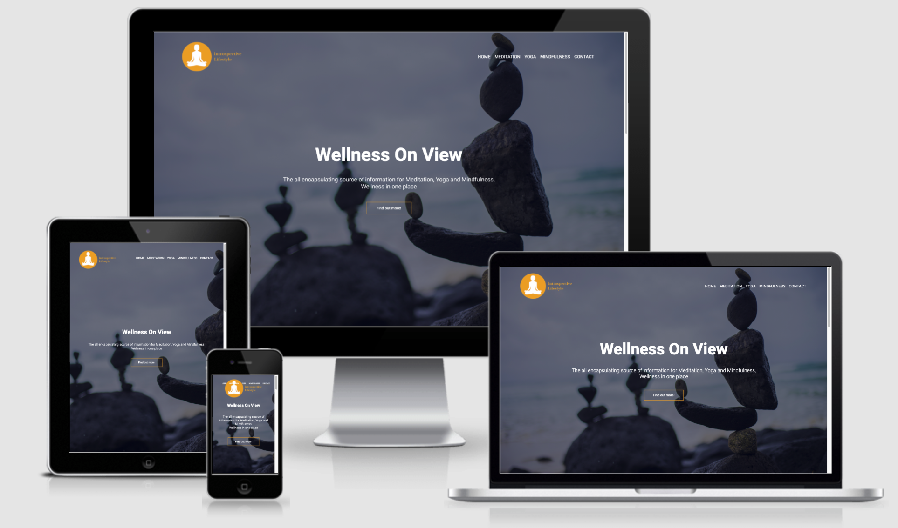
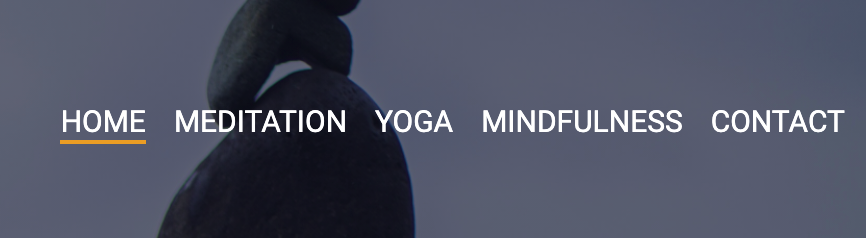
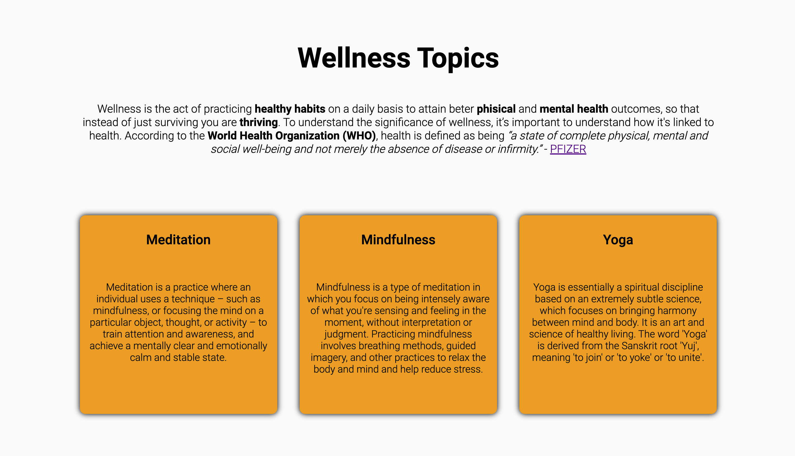
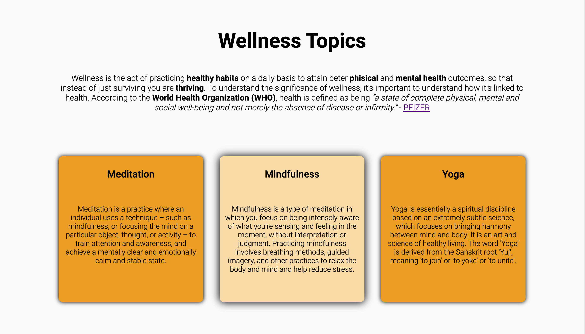
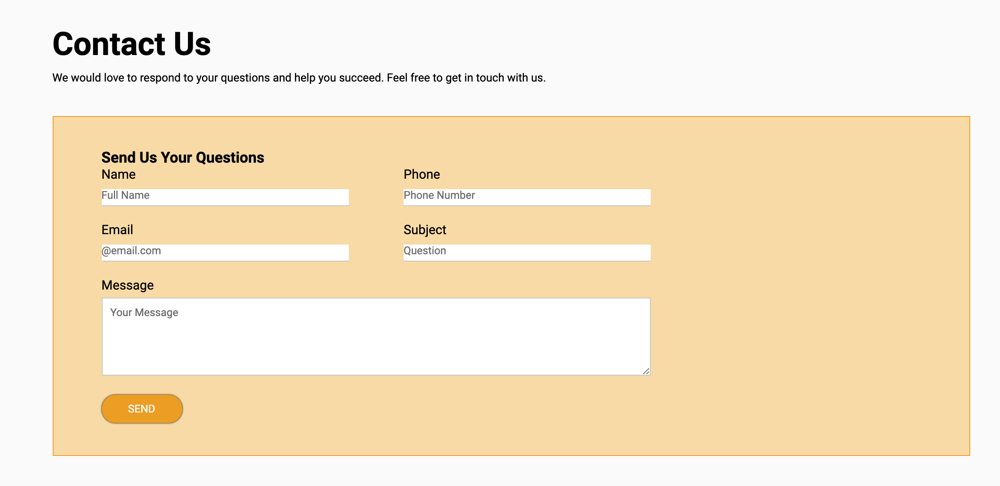

# Introspective Lifestyle

  
Table of Contents

  <ol>
    <li>
      <a href="#about-the-project">About The Project</a>
      <ul>
        <li><a href="#built-with">Built With</a></li>
      </ul>
    </li>
    <li><a href="#features">Features</a></li>
    <li><a href="#validation">Validation</a></li>
    <li><a href="#contributing">Contributing</a></li>
    <li><a href="#contact">Contact</a></li>
    <li><a href="#acknowledgments">Acknowledgments</a></li>
  </ol>

## About the Project
Introspective Lifestyle is a Lifestyle website designed to add the users phisical and mental health. 
Introspective Lifestyle is the all encapsulating source of information for Meditation, Yoga and Mindfulness, Wellness in one place

### Built With
* [HTML 5
(HyperText Markup Language)](https://en.wikipedia.org/wiki/HTML)
* [CSS (Cascading Style Sheets)](https://en.wikipedia.org/wiki/CSS)

## Features
Introspective Lifestyle website is designed for straightforward use so that the user can easily learn and implement what they have learned into their day to day life

### Responsive Design
* Website is designed to be used across multiple devices

### Landing Page
* The landing page is equipped with many navigation features.

* The easy to use navigation bar allows for swift transfer through each page, when hovered over an orange line appears under the word.

* The logo at the top of the page is a link back to the home page.

### Interactive Elements
* Interactive elements can be seen on the navigation bar when the user hovers over a word an orange bar appears under it.

* When the user hovers over box elements they will change colour and add a shadow to the background for easier visibility.

### Video Elements
* Video elements are used to support the text content on the page, the videos allows the user to practice what they have learned

### Footer
* A footer is deployed across all pages keeping the site uniform.

### Contact Form
* 

## Validation
* HTML Files passed the [HTML Validator](https://validator.w3.org/nu/) with no errors.
* CSS file passed the [CSS Validator](https://jigsaw.w3.org/css-validator/validator) with no errors.

## Contributing
1. Fork the Project
2. Create your Feature Branch
3. Commit your Changes
4. Push to the Branch
5. Open a Pull Request

## Deployment 
Introspective Lifestyle was deployed to [GitHub Pages](https://pages.github.com/)

## Contact
Jack Pitman - PitmanJack2@gmail.com  
GitHub Repo [Project Link](https://github.com/JPitman26/Milestone-Project-1-Resubmit)

## Acknowledgments
* [Photos Sourced](https://www.pexels.com/)
* [Font Awesome Icons](https://fontawesome.com/v4.7/)
* [Code Research](https://developer.mozilla.org/en-US/)
* [Font From GoogleFonts](https://fonts.google.com/specimen/Roboto)
* [HTML Validation](https://validator.w3.org/nu/)
* [CSS Validation](https://jigsaw.w3.org/css-validator/validator)
* [Am I Responsive](http://ami.responsivedesign.is/#)
* [Colour Wheel](https://www.canva.com/colors/color-wheel/)
* HTML Boilerplate - VS Code Extensions - sidthesloth
* Markdown All in One - VS Code Extensions - Yu Zhang
